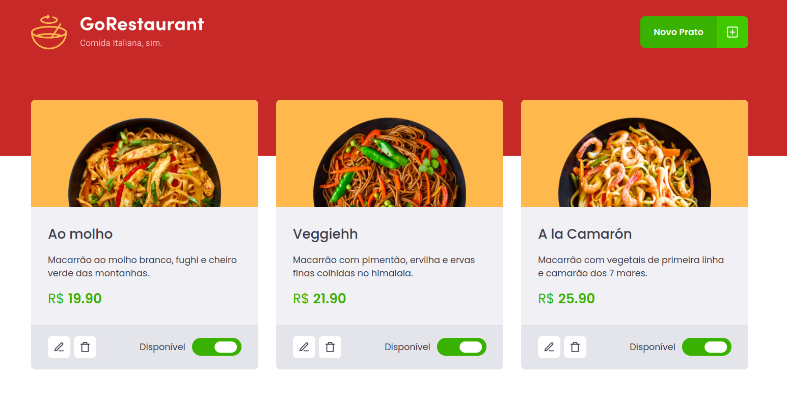

<h1 align="center">Welcome to GoRestaurant-Web :ramen:</h1>
<p>
  
</p>

> A restaurant management application to check dishes availability. This application was developed as a challenge of the Rocketseat Gostack BootCamp.

## Preview

 
 
## Others repositories of this project :books:
* <a href="https://github.com/lscborges1/GoBarber-Mobile">Mobile Front-end</a>


## Technologies Used

* React ⚛️
* Styled-Components 💅🏻
* Jest 🃏
* Typescript :blue_book:

## Usage

```sh
yarn 
```

```sh
yarn json-server server.json -p 3333
```
```sh
yarn run start
```

## Run tests

```sh
yarn run test
```

## Author

👤 **Lucas Borges**

* Github: [@lscborges1](https://github.com/lscborges1)

## Show your support

Give a ⭐️ if this project helped you!


